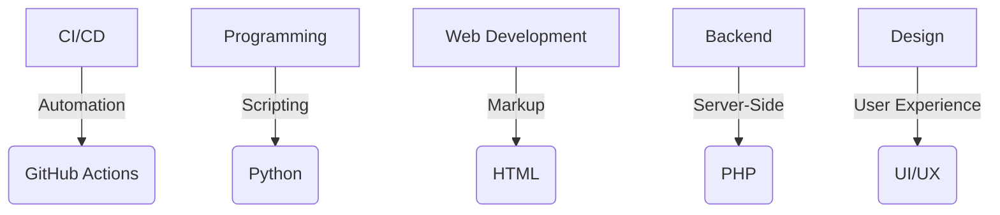

  

<h1 align="center"> 
  
</h1>

  🚀 Programmer Pemula | 📚 Pembaca & Penulis | 🎨 Desain Grafis  

Ammar Siraj Ananda, pemuda yang sedang menempuh program studi teknik informatika, hobinya membaca dan menulis. Seiring waktu berjalan banyak tantangan yang dilalui namun tidak membuatnya berhenti. Jadi, akhirnya gimana ya?

## 🏆 **Pencapaian Di GitHub**

  

## 🛠 **Aplikasi Rutin**

  

## 🚀 Skills

## 🚀 **Proyek Buatan Sendiri**
🎨 **[Portofolio Pribadi](https://ammar3544.github.io/ammar3544/Laprak%201.html#)**  
📊 **[Website Politik Indonesia](https://ammar3544.github.io/ammar3544/Politik.html)**  
🛒 **[Website E-Commerce (Coming Soon! 🚧)](https://ammar3544.github.io/ammar3544/Website%20E-Commerce.html)** 

## 🎯 **Goals 2025**
🚀 **Belajar python**  
  Biar percaya diri manggil diri sendiri *Developer Junior*

🏆 **Membangun Website E-Commerc**  
  Mau jualan jasa desain dan coding

🎖 **Membuat Novel**  
  Akhir tahun mau nulis novel 2 tahun belakang.

## 📚 Bacaan Yang Pernah Kubaca

  
  
  
  

## ☕ Rehat Sejenak....
<table>
  <tr>
    <td align="left" width="70%">
      

        Berusaha tanpa istirahat itu nggak baik, tapi nggak ada usaha juga nggak baik..  
        Jadi, bagusnya apa ya?   
        Bagusnya, tentuin apa yang mau kamu usahain.. tapi jangan lupa kalau kereta aja ada stasiun untuk rehat sejenak,  
        masa kamu nggak?
      

    </td>
    <td align="right" width="55%">
      
    </td>
  </tr>
</table>

## 💬 **Quote Inspiratif**
*"Don't ever let anyone make you feel like you don't deserve what you want."*
***-10 Things I Hate About You***

## 🌎 **Mutualan Yuk!**

  
  
  

  Mau ngobrol? Kirim surat aja : <a href="mailto:ammarsananda345@gmail.com">ammarsananda345@gmail.com</a>

## 🕒 Jam Ngoding

  

## 📊 **Statistik GitHub**

  

  

  

